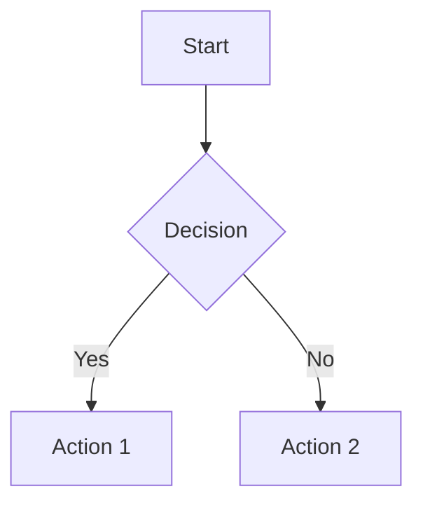
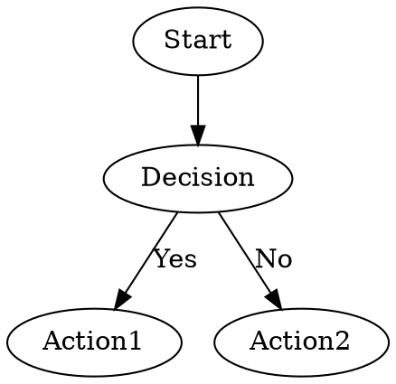
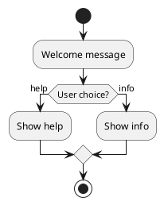

# ZFlo Telegram Bot

A CLI tool that runs ZFlo flows as Telegram bots. Load any flow file (JSON, Mermaid, DOT, or PlantUML) and instantly create an interactive Telegram bot.

## Features

- 🤖 **Universal Flow Support**: Load flows from JSON, Mermaid, DOT, or PlantUML files
- 🔄 **Auto-Detection**: Automatically detects and parses flow formats
- 📡 **Flexible Deployment**: Supports both polling and webhook modes
- ✅ **Validation**: Validate flow files before deployment
- 🎯 **CLI Interface**: Simple command-line interface for easy usage
- 🔧 **Environment Config**: Configure via environment variables or CLI options

## Installation

```bash
# Install dependencies
pnpm install

# Build the CLI
pnpm build

# Link for global usage (optional)
npm link
```

## Quick Start

1. **Create a Telegram Bot**:
   - Message [@BotFather](https://t.me/botfather) on Telegram
   - Use `/newbot` command and follow instructions
   - Save your bot token

2. **Prepare a Flow File**:

   ```json
   {
     "id": "greeting-bot",
     "title": "Greeting Bot",
     "startNodeId": "start",
     "nodes": [
       {
         "id": "start",
         "type": "message",
         "title": "Welcome!",
         "content": "Hello! I'm your ZFlo bot. How can I help you today?",
         "outlets": [
           { "to": "help", "label": "Get Help" },
           { "to": "info", "label": "Bot Info" }
         ]
       },
       {
         "id": "help",
         "type": "message",
         "title": "Help",
         "content": "I can help you navigate through this flow. Use the buttons to interact with me!"
       },
       {
         "id": "info",
         "type": "message",
         "title": "Info",
         "content": "I'm powered by ZFlo flows and running on Telegram!"
       }
     ]
   }
   ```

3. **Start Your Bot**:
   ```bash
   zflo-telegram-bot start my-flow.json --token YOUR_BOT_TOKEN
   ```

## Usage

### Commands

#### `start <flow-file>`

Start a Telegram bot with the specified flow file.

```bash
zflo-telegram-bot start my-flow.json --token YOUR_TOKEN
zflo-telegram-bot start flow.mermaid --token YOUR_TOKEN --name "My Bot"
zflo-telegram-bot start diagram.puml --webhook https://mybot.com/webhook
```

**Options:**

- `-t, --token <token>` - Telegram bot token
- `-n, --name <name>` - Bot name
- `-d, --description <description>` - Bot description
- `-w, --webhook <url>` - Webhook URL for production
- `-p, --port <port>` - Webhook port (default: 3000)
- `--log-level <level>` - Log level (debug, info, warn, error)

#### `validate <flow-file>`

Validate a flow file without starting the bot.

```bash
zflo-telegram-bot validate my-flow.json
zflo-telegram-bot validate complex-flow.mermaid
```

#### `info`

Show information about supported formats and configuration.

```bash
zflo-telegram-bot info
```

### Environment Variables

Create a `.env` file for easier configuration:

```env
TELEGRAM_BOT_TOKEN=your_bot_token_here
WEBHOOK_URL=https://your-domain.com/webhook
WEBHOOK_PORT=3000
FLOW_FILE_PATH=./flows/my-flow.json
BOT_NAME=My ZFlo Bot
BOT_DESCRIPTION=A bot powered by ZFlo flows
LOG_LEVEL=info
```

## Supported Flow Formats

### JSON (ZFlo Native)

```json
{
  "id": "my-flow",
  "title": "My Flow",
  "startNodeId": "start",
  "nodes": [...]
}
```

### Mermaid



### DOT (Graphviz)



### PlantUML



## Deployment

### Development (Polling)

```bash
zflo-telegram-bot start my-flow.json --token YOUR_TOKEN
```

### Production (Webhook)

```bash
zflo-telegram-bot start my-flow.json \
  --token YOUR_TOKEN \
  --webhook https://yourdomain.com/webhook \
  --port 3000
```

## Examples

### Simple Greeting Bot

```bash
# Create a simple flow
echo '{
  "id": "greeting",
  "title": "Greeting Bot",
  "startNodeId": "welcome",
  "nodes": [{
    "id": "welcome",
    "type": "message",
    "content": "Hello! Welcome to my bot!"
  }]
}' > greeting.json

# Start the bot
zflo-telegram-bot start greeting.json --token YOUR_TOKEN
```

### Customer Support Bot

```bash
# Validate first
zflo-telegram-bot validate support-flow.mermaid

# Start with webhook
zflo-telegram-bot start support-flow.mermaid \
  --token YOUR_TOKEN \
  --webhook https://mybot.herokuapp.com/webhook \
  --name "Support Bot" \
  --description "24/7 Customer Support"
```

## Development

```bash
# Install dependencies
pnpm install

# Build in watch mode
pnpm dev

# Type check
pnpm type-check

# Test the CLI locally
node dist/cli.js info
```

## Troubleshooting

### Common Issues

1. **"Bot token is required"**
   - Set `TELEGRAM_BOT_TOKEN` environment variable
   - Or use `--token` option

2. **"Flow file not found"**
   - Check file path is correct
   - Use absolute paths if needed

3. **"Invalid flow file"**
   - Run `validate` command first
   - Check flow syntax matches supported formats

4. **Webhook not working**
   - Ensure webhook URL is accessible from internet
   - Check port configuration
   - Verify SSL certificate for HTTPS

### Debug Mode

```bash
zflo-telegram-bot start my-flow.json --token YOUR_TOKEN --log-level debug
```

## License

MIT
