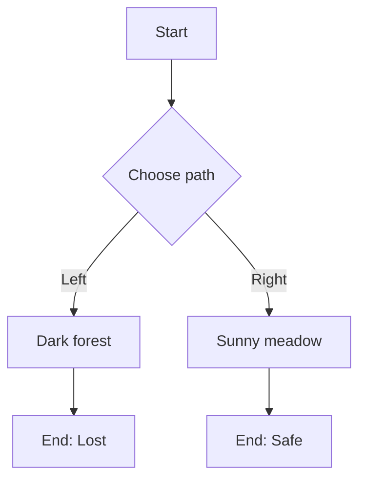

# Data Format

## ZFlo Internal Format

The core engine uses a normalized JSON format that represents flowcharts as directed graphs.

### Schema

```typescript
interface FlowDefinition {
  id: string;
  title: string;
  description?: string;
  expressionLanguage?: 'cel';
  globalState?: Record<string, unknown>;
  stateSchema?: JSONSchema7; // optional JSON Schema validation
  stateRules?: StateRule[]; // optional rule engine
  autoAdvance?: 'always' | 'default' | 'never';
  metadata?: Record<string, unknown>;
  nodes: NodeDefinition[];
  startNodeId: string;
}

interface NodeDefinition {
  id: string;
  title: string;
  content?: string; // supports ${...} interpolation
  actions?: StateAction[]; // executed on node enter
  outlets?: OutletDefinition[]; // edges
  autoAdvance?: 'always' | 'default' | 'never';
  metadata?: Record<string, unknown>;
}

interface StateAction {
  type: 'set' | 'add' | 'remove' | 'increment';
  target: string;
  value?: any;
}

interface StateCondition {
  expression: string;
  targetEdge?: string;
}
```

### Node Types

#### Start Node

```json
{
  "id": "start",
  "type": "start",
  "title": "Begin Adventure",
  "content": "Welcome to your adventure!"
}
```

#### Action Node

```json
{
  "id": "action1",
  "type": "action",
  "title": "Enter the Forest",
  "content": "You step into the dark forest. The trees tower above you, their branches creating a canopy that blocks most sunlight.",
  "actions": [
    {
      "type": "set",
      "target": "location",
      "value": "forest"
    },
    {
      "type": "add",
      "target": "inventory",
      "value": "map"
    }
  ]
}
```

#### Decision Node

```json
{
  "id": "decision1",
  "type": "decision",
  "title": "Choose Your Path",
  "content": "You come to a fork in the path. Which way do you go?"
}
```

#### Condition Node

```json
{
  "id": "condition1",
  "type": "condition",
  "title": "Check Equipment",
  "conditions": [
    {
      "expression": "\"sword\" in inventory && health > 50",
      "targetEdge": "fight-path"
    },
    {
      "expression": "\"key\" in inventory",
      "targetEdge": "unlock-path"
    }
  ]
}
```

Note: Expressions use CEL by default.

#### End Node

```json
{
  "id": "end1",
  "type": "end",
  "title": "Victory!",
  "content": "Congratulations! You have completed your adventure successfully."
}
```

### Edges

Edges define the connections between nodes with optional conditions:

```json
{
  "id": "edge1",
  "from": "decision1",
  "to": "action2",
  "label": "Go left",
  "condition": "choice === 'left'"
}
```

#### Conditional Edges

```json
{
  "id": "auto-edge",
  "from": "condition1",
  "to": "dragon-fight",
  "condition": "\"sword\" in inventory && health > 50",
  "priority": 1
}
```

#### Outlet Actions

Outlets can execute actions when traversed:

```json
{
  "id": "path-with-actions",
  "from": "choice-node",
  "to": "result-node",
  "label": "Take the sword",
  "actions": [
    {
      "type": "add",
      "target": "inventory",
      "value": "sword"
    },
    {
      "type": "set",
      "target": "weapon",
      "value": "sword"
    }
  ]
}
```

## Format Adapters

### Mermaid Support

The system converts Mermaid flowcharts to ZFlo format:



### Expert System Extensions

The format supports advanced expert system features:

- **State Variables**: Persistent data across the entire session
- **Conditional Logic**: Complex branching based on accumulated state
- **State Actions**: Modify state when entering/exiting nodes
- **Rule Evaluation**: Automatic path selection based on conditions
- **Priority System**: Handle multiple valid conditions

#### State Management Example

```json
{
  "globalState": {
    "inventory": [],
    "health": 100,
    "location": "start",
    "flags": {}
  },
  "stateRules": [
    {
      "condition": "health <= 0",
      "action": "forceTransition",
      "target": "game-over"
    }
  ]
}
```
