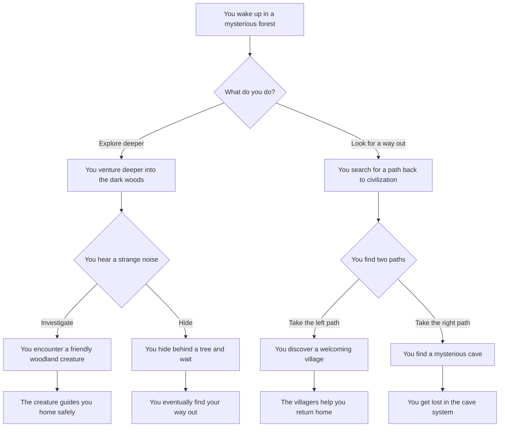
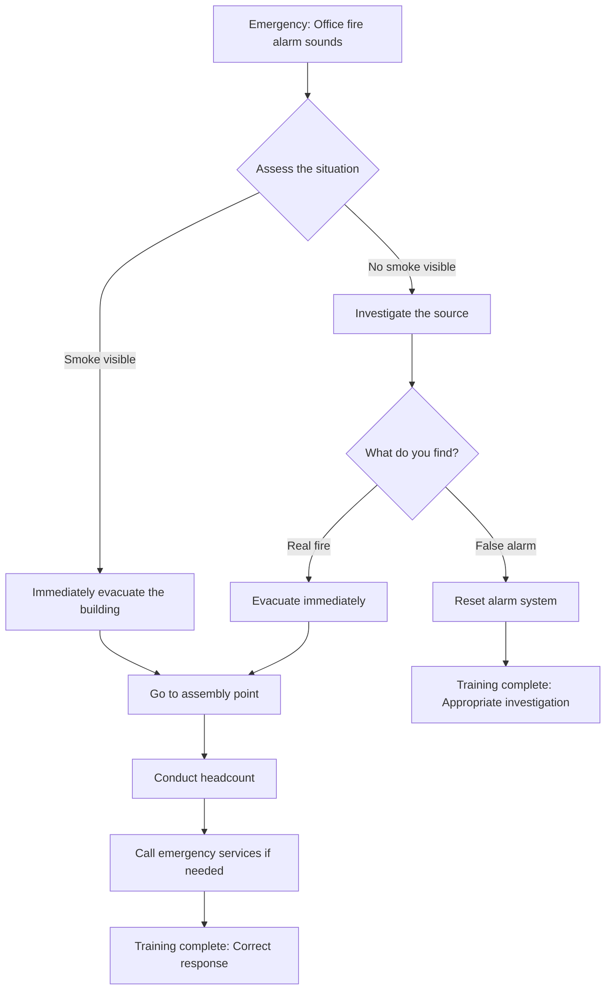

# Examples

## Choose Your Own Adventure Story

### Mermaid Input



### Generated Experience

**Step 1: Start Node**

```
You wake up in a mysterious forest

[Continue]
```

**Step 2: Decision Node**

```
What do you do?

[Explore deeper] [Look for a way out]
```

**Step 3a: If "Explore deeper"**

```
You venture deeper into the dark woods

[Continue]
```

**Step 4a: Next Decision**

```
You hear a strange noise

[Investigate] [Hide]
```

## Simple Decision Tree

### ZFlo Native Format

```json
{
  "id": "coffee-decision",
  "title": "Coffee Shop Decision",
  "description": "Help users choose their perfect coffee",
  "startNodeId": "start",
  "nodes": [
    {
      "id": "start",
      "type": "start",
      "title": "Welcome to Coffee Corner",
      "content": "Let's find your perfect coffee!"
    },
    {
      "id": "caffeine-choice",
      "type": "decision",
      "title": "Caffeine Preference",
      "content": "How much caffeine do you want?"
    },
    {
      "id": "high-caffeine",
      "type": "decision",
      "title": "High Caffeine Options",
      "content": "What's your flavor preference?"
    },
    {
      "id": "espresso",
      "type": "end",
      "title": "Perfect Match: Espresso",
      "content": "A strong, bold espresso is perfect for you!"
    },
    {
      "id": "americano",
      "type": "end",
      "title": "Perfect Match: Americano",
      "content": "A smooth americano gives you caffeine without overwhelming flavor."
    }
  ],
  "edges": [
    {
      "id": "start-to-caffeine",
      "from": "start",
      "to": "caffeine-choice"
    },
    {
      "id": "high-caffeine-choice",
      "from": "caffeine-choice",
      "to": "high-caffeine",
      "label": "High caffeine"
    },
    {
      "id": "bold-choice",
      "from": "high-caffeine",
      "to": "espresso",
      "label": "Bold and intense"
    },
    {
      "id": "smooth-choice",
      "from": "high-caffeine",
      "to": "americano",
      "label": "Smooth and mild"
    }
  ]
}
```

## Training Scenario

### Emergency Response Training



## Interactive Tutorial

### React Component Usage Tutorial

```typescript
// This could be generated from a Mermaid diagram
const tutorialFlowchart = {
  id: 'react-tutorial',
  title: 'Learn ZFlo React Components',
  startNodeId: 'welcome',
  nodes: [
    {
      id: 'welcome',
      type: 'start',
      title: 'Welcome to ZFlo',
      content: "Let's learn how to use ZFlo React components!",
    },
    {
      id: 'setup-choice',
      type: 'decision',
      title: 'Setup Method',
      content: 'How would you like to set up your project?',
    },
    {
      id: 'npm-install',
      type: 'action',
      title: 'NPM Installation',
      content: 'Run: npm install @zflo/react @zflo/core',
    },
    {
      id: 'first-component',
      type: 'action',
      title: 'Your First Component',
      content: 'Import FlowPlayer and pass it a flowchart prop',
    },
  ],
  edges: [
    { id: '1', from: 'welcome', to: 'setup-choice' },
    { id: '2', from: 'setup-choice', to: 'npm-install', label: 'Use NPM' },
    { id: '3', from: 'npm-install', to: 'first-component' },
  ],
};
```

## Usage in Code

### Basic React Implementation

```tsx
import React from 'react';
import { FlowPlayer } from '@zflo/react';
import { MermaidParser } from '@zflo/core';

const adventureStory = `
flowchart TD
    A[Your adventure begins] --> B{Choose your path}
    B -->|Forest| C[Into the woods]
    B -->|Mountain| D[Up the mountain]
    C --> E[You find treasure!]
    D --> F[You reach the summit!]
`;

function AdventureGame() {
  const parser = new MermaidParser();
  const flowchart = parser.parse(adventureStory);

  return (
    <div className="adventure-game">
      <h1>Choose Your Adventure</h1>
      <FlowPlayer
        flowchart={flowchart}
        onComplete={(history) => {
          console.log('Adventure completed!', history);
        }}
      />
    </div>
  );
}
```

### Custom Node Rendering

```tsx
import { useFlowchartEngine } from '@zflo/react';

function CustomAdventure({ flowchart }) {
  const { currentNode, choices, makeChoice, isComplete } =
    useFlowchartEngine(flowchart);

  if (isComplete) {
    return <div className="completion">Adventure Complete! 🎉</div>;
  }

  return (
    <div className="custom-adventure">
      <div className="story-content">
        <h2>{currentNode?.title}</h2>
        <p>{currentNode?.content}</p>
      </div>

      {choices.length > 0 && (
        <div className="choices">
          {choices.map((choice) => (
            <button
              key={choice.id}
              onClick={() => makeChoice(choice.id)}
              className="choice-button"
            >
              {choice.label}
            </button>
          ))}
        </div>
      )}
    </div>
  );
}
```
